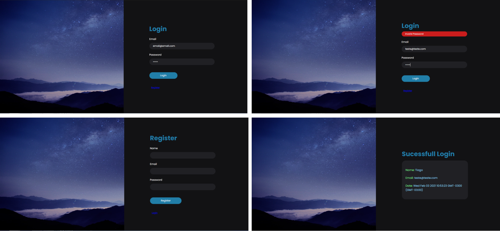

# User Authentication Node.Js
- [See this project working](https://tiagopires-user-authentication.herokuapp.com/)

## About this Project

Login/Register form with authentication and password hashing

## Built With

 - [Passport.Js](http://www.passportjs.org/) - User Authentication
 - [Bcrypt](https://www.npmjs.com/package/bcrypt) - Password Hashing
 - [Node.Js](https://nodejs.org/en/) - Build
 - [Express](https://expressjs.com/) - Server and Routes Configuration
 - [Ejs](https://ejs.co/) - View Engine
 - [MongoDB](https://www.mongodb.com/) - Database
 - [Mongoose](https://mongoosejs.com/) - Manage MongoDB Data
